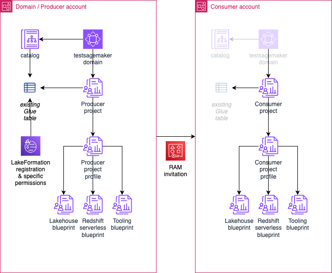

# SageMaker Unified Studio / a simple multi-account prototype

This repo contains script that will help you setup a SageMaker domain and producer project in one account, then a consumer project in a second account.  

The goal is to demonstrate how 2 teams can collaborate using SageMaker, one team importing an existing table in its project and publishing it in the catalog, the other team subscribing to this asset and querying it from another account.  

SageMaker Unified Studio relies on DataZone API.  
The UI/console is orchestrating a lot of calls to the API and there's not much existing material describing these workflows.  
I sniffed the UI/console calls to build this example, I'm sure there's a better approach in some areas, that's the best I was able to figure out so far.  
An IoC approach would also be preferable however I'm not sure the service is mature enough yet.  

I experienced a number of limitations with the service that you have to keep in mind if you modify the scripts:
- it does not support yet hybrid mode, so when you register the location of your table, use lake formation mode only
- the default quota is forcing you to clean the environments left over in the producer account (CloudFormation stacks)

## setup

A number of scripts are available in the `setup` folder.  

Start with the configuration script, update its content and capture credentials for your domain/procucer and consumer accounts, then launch the script to define common environment variables.  
`
. ./config.sh
`

Create the test table in the standard catalog.  
`
./setup/table.sh
`

Create the domain.  
`
./setup/domain.sh
`

Create the producer artefacts (ex. the environment and project).  
`
./setup/producer.sh
`

Import the table in the producer environment.  
`  
./setup/import.sh  
`  

Create the consumer artefacts (ex. the remote environment and project).  
`
./setup/consumer.sh
`

At the moment I don't know how to script the publish and subscribe workflows.  
You have to execute this part manually, connecting to the studio:
- access the producer project to publish the inventory table in the domain catalog
- access the catalog and subscribe to the asset for the consumer project
- access the producer project to accept the subscription request

## cleanup

Cleaning up the consumer and producer resources is not straightforward.  
I chose a fairly radical approach and delete the domain as a whole.  
It leaves a lot of orphan resources behind but it is good enough to start over and recreate the same test bed.  
I'll document to the best of my knowledge the resources to clean manually if you want to restore the initial state.  

`  
./cleanup/domain.sh  
`  
`  
./cleanup/table.sh  
`  

Resources left behind:
- CloudFormation stacks for the environments/projects
- CodeCommit repositories for the environments/projects
- S3 buckets for the domain and environments
- IAM roles for the domain and environments
- RAM shared resources
- LakeFormation permissions and administrators
